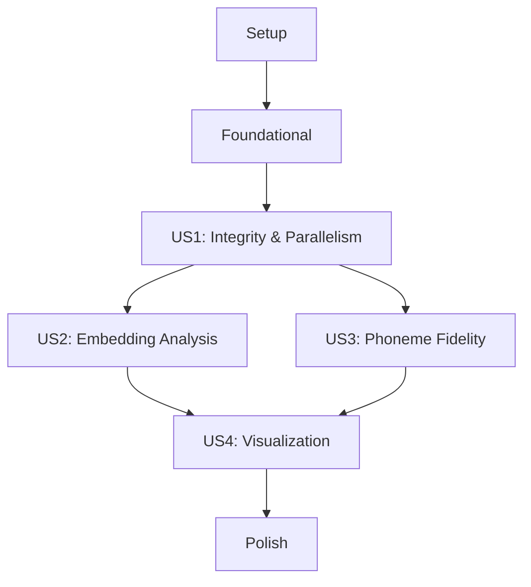

# Tasks: Dataset Comparison

## Implementation Strategy
We will follow an incremental delivery approach, starting with the data integrity and foundational utilities (MVP) before moving into the specialized embedding and phoneme comparison logic. Each phase corresponds to a user story from the specification.

## Dependency Graph

## Phase 1: Setup
- [ ] T001 Initialize the subproject directory with `dataset_comparison/__init__.py`
- [ ] T002 Create shared constants (thresholds, default paths) in `dataset_comparison/constants.py`

## Phase 2: Foundational
- [ ] T003 [P] Implement metadata loading for speaker status (PD/HC) in `dataset_comparison/data_loader.py`
- [ ] T004 [P] Implement speaker ID parsing and filename matching utilities in `dataset_comparison/utils.py`

## Phase 3: User Story 1 - Dataset Integrity & Parallelism (P1)
**Goal**: Verify that the test dataset is a parallel version of the reference.
**Independent Test Criteria**: Run `run_comparison.py` and verify `comparison_integrity.csv` lists all missing files and mismatches.

- [ ] T005 [P] [US1] Implement file existence checking across directories in `dataset_comparison/integrity.py`
- [ ] T006 [P] [US1] Implement transcription (.txt) identity validation in `dataset_comparison/integrity.py`
- [ ] T007 [US1] Implement audio duration calculation and delta reporting in `dataset_comparison/audio_utils.py`

## Phase 4: User Story 2 - Embedding Distance Analysis (P1)
**Goal**: Quantify embedding similarity between reference and test samples.
**Independent Test Criteria**: Verify `comparison_metrics.csv` contains valid Cosine distances for parallel `.pt` pairs.

- [ ] T008 [P] [US2] Implement PyTorch embedding loading and Cosine distance calculation in `dataset_comparison/embeddings.py`
- [ ] T009 [US2] Implement speaker and task-group aggregation for embedding distances in `dataset_comparison/embeddings.py`

## Phase 5: User Story 3 - Phoneme Duration & Alignment Fidelity (P1)
**Goal**: Evaluate temporal fidelity and identify missing phonemes.
**Independent Test Criteria**: Verify phoneme deltas are correctly calculated and missing tokens are flagged in reports.

- [ ] T010 [P] [US3] Implement semicolon-separated CSV alignment parsing in `dataset_comparison/phonemes.py`
- [ ] T011 [US3] Implement pairwise phoneme duration delta calculation and "missing" detection in `dataset_comparison/phonemes.py`

## Phase 6: User Story 4 - Visual Comparative Reporting (P2)
**Goal**: Provide interactive visualization of comparison results.
**Independent Test Criteria**: Open the notebook and verify plots render correctly for both HC and PD groups.

- [ ] T012 [US4] Create the main orchestration script `dataset_comparison/run_comparison.py` to export results to `reports/`
- [ ] T013 [US4] Develop the visualization notebook `dataset_comparison/dataset_comparison_viz.ipynb` with group-wise distance plots

## Phase 7: Polish
- [ ] T014 Add comprehensive logging and robust error handling for missing task directories in `dataset_comparison/run_comparison.py`
- [ ] T015 Ensure all scripts follow project coding standards (cd src; ruff check .)

## Parallel Execution Examples
- **US1 & US2**: Integrity checking (T005) and Embedding loading (T008) can be developed in parallel as they target different file types.
- **US3**: Phoneme parsing (T010) is independent of Embedding logic and can be developed concurrently.
